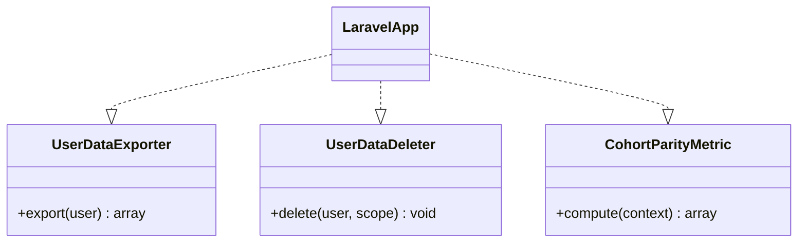

# Data Model and Contract

The package stores compliance records in package-owned tables while delegating domain extraction and deletion to host contracts.

## Data model

| Table | Purpose |
| --- | --- |
| `risk_register_entries` | AI use-case inventory and classification |
| `dsar_requests` | Access and deletion request state |
| `consent_records` | Consent grants and revocations |
| `human_reviews` | Human oversight queue |
| `incident_tickets` | Incident record |
| `incident_state_transitions` | Immutable incident history |
| `bias_snapshots` | Cohort metric results |
| `compliance_attestations` | Audit-ready attestations |
| `regulatory_amendments` | Feed-detected regulatory changes |
| `tenants` | Tenant registry and overrides |

## Contract boundary

::: callout warning "Contract ownership"
Host contracts must be versioned and tested with representative production data shapes. The package cannot infer hidden data stores.
:::
