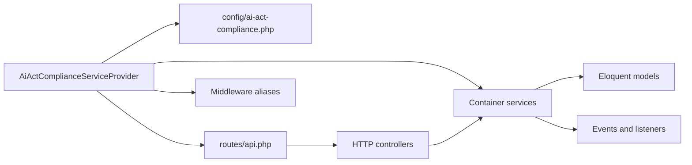

# Architecture Overview

The package is loaded by `AiActComplianceServiceProvider`, which registers configuration, routes, middleware, services, events, and package resources.

## Runtime layers

| Layer | Contents |
| --- | --- |
| HTTP | Controllers for overview, settings, DSAR, consent, risks, incidents, bias, reviews, attestations, regulatory amendments, tenants |
| Domain services | Risk, DSAR, FRIA, bias, consent, incident, human review, tenant config, regulatory polling |
| Persistence | Migrations and Eloquent models |
| Integration | Alert channels, regulatory feed drivers, host contracts |

::: callout tip "Architecture rule"
Keep package services at the workflow boundary. Put application-specific data fetching, identity proofing, and model telemetry in host implementations.
:::
