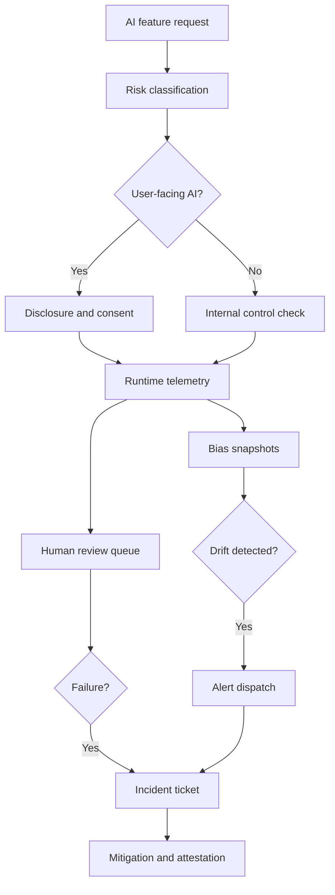

# Pipeline and Workflow

## Workflow gates

::: steps
1. Register the use case before launch.
2. Enable request-time controls for transparency, consent, security, and tenant scope.
3. Capture operational metrics and human review decisions.
4. Escalate drift or failures through alerting and incident state transitions.
5. Produce attestation evidence for audits and customer requests.
:::
