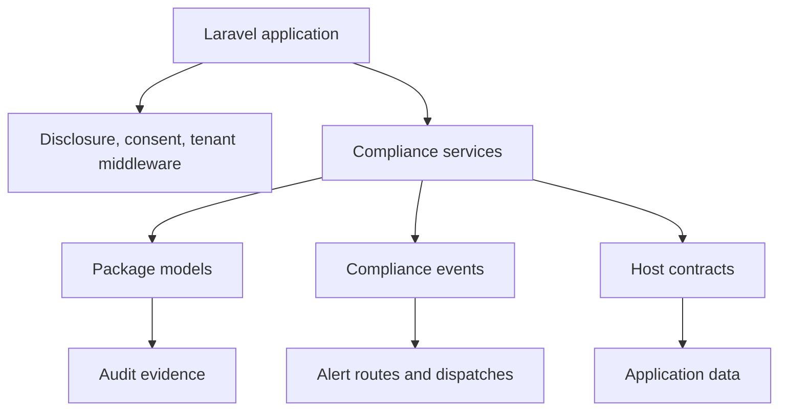

# Design

The package follows four design principles: Laravel-native APIs, config-gated modules, explicit host contracts, and durable audit records.

## Module boundaries

::: tabs
### Middleware

Middleware handles request-time controls such as disclosure, consent, cybersecurity, and tenant context.

### Services

Services implement workflows for DSAR, FRIA, risk register, bias monitoring, incidents, and attestations.

### Models

Models preserve records used by dashboards, APIs, reports, and auditors.
:::

::: collapsible "Why contracts instead of discovery"
DSAR and bias workflows need domain-specific data. Explicit contracts make that dependency visible and testable instead of scanning arbitrary application models.
:::
