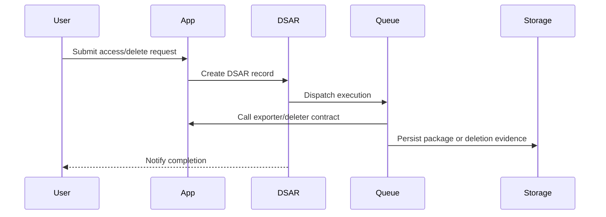

# DSAR Workflow

DSAR support depends on host application contracts because only your app knows where user data lives.

## Contracts

```php
use Padosoft\AiActCompliance\DSAR\Contracts\UserDataExporter;
use Padosoft\AiActCompliance\DSAR\Contracts\UserDataDeleter;

class UserExporter implements UserDataExporter
{
    public function export($user): array
    {
        return [
            'profile' => $user->only(['id', 'name', 'email']),
            'messages' => $user->messages()->latest()->get()->toArray(),
        ];
    }
}

class UserDeleter implements UserDataDeleter
{
    public function delete($user, array $scope): void
    {
        $user->messages()->delete();
    }
}
```

## Flow



::: callout danger "Identity verification"
Do not execute access or deletion until the host application has verified the requester and scope.
:::
