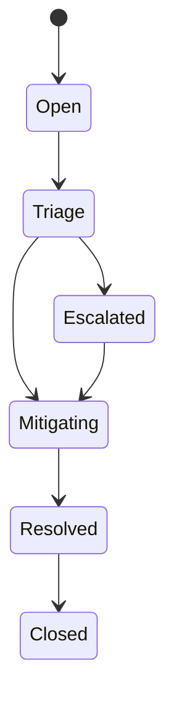

# Human Review and Incidents

Human review tracks decisions that need oversight. Incidents track failures, severity, mitigation, and escalation.

## Incident state machine



## Open and transition an incident

```php
use Padosoft\AiActCompliance\Incident\Enums\IncidentSeverity;
use Padosoft\AiActCompliance\Incident\Enums\IncidentStatus;

$ticket = app('ai-act.incidents')->open([
    'title' => 'Unexpected refusal rate for enterprise users',
    'severity' => IncidentSeverity::High,
    'articles' => ['AI Act Art. 14', 'AI Act Art. 15'],
]);

app('ai-act.incidents')->transition($ticket, IncidentStatus::Triage);
```

::: callout warning "Immutable transitions"
Treat state transitions as audit records. Correct mistakes with compensating transitions or notes instead of mutating history.
:::
