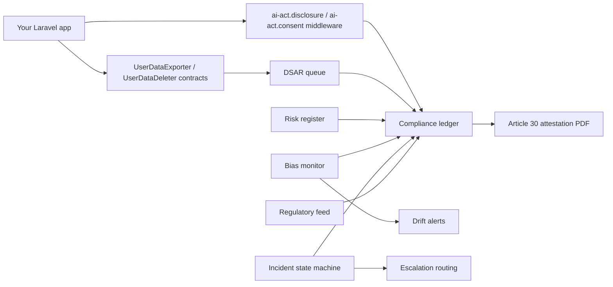

# laravel-ai-act-compliance


> **laravel-ai-act-compliance is the first Laravel-native toolkit for EU AI Act + GDPR compliance.**
> Plug it into any Laravel app that uses an LLM and ship disclosure, consent, a risk register, DSAR
> workflows, bias monitoring, human review, incident response and auditor-ready attestation — every
> module config-gated, migration-published, tested and mapped to the exact regulation article it
> satisfies. Self-hosted, multi-tenant, EU-compliant by design.

::: callout info "New here? Read this page top to bottom" icon:compass
In five minutes you'll know exactly what this package is, the compliance problem it closes, why it
beats every "we'll deal with the AI Act later" alternative, and where to click next. Every other page
goes deeper — this one gives you the whole picture.
:::

---

## What it is — in one minute

The EU AI Act enters full force in 2026–2027. Python teams have Lakera Guard, Fairlearn and Aequitas.
**Laravel teams have had nothing** — so AI Act and GDPR obligations get hand-rolled, half-finished, or
deferred until an enterprise buyer's security questionnaire forces the issue.

`laravel-ai-act-compliance` gives the compliance side of your AI feature the same first-class treatment
your business logic already has — durable Laravel models, focused services, middleware and an HTTP API,
each wired to the article it answers:

- **Disclose and gate** — an `@aiDisclosure` Blade directive and `ai-act.disclosure` / `ai-act.consent`
  middleware tell users they're talking to an AI and block features until consent is on record.
- **Register risk and evidence** — classify every AI use case (`unacceptable` / `high` / `limited` /
  `low`) against Annex III, snapshot cohort-parity bias metrics, and route serious incidents up an
  escalation tree.
- **Honour data rights** — a DSAR queue handles identity verification, the 30-day SLA, breach
  escalation, ZIP packaging and an immutable audit trail; you implement two contracts, the package does
  the regulatory ugliness.

> **In one line:** *the AI Act + GDPR brick Laravel is missing — disclosure, consent, risk, DSAR, bias,
> incidents and attestation, audit-ready, from inside your own Laravel app.*

---

## The problem it solves

Every team shipping an LLM feature hits the same wall: compliance is undefined, unevidenced and
deferred until it's a deal-blocker. Here is the gap this package closes.

| Without laravel-ai-act-compliance | With laravel-ai-act-compliance |
|---|---|
| You hand-roll AI disclosure, consent gating and rate limiting — and get the edge cases wrong. | Battle-tested `@aiDisclosure` directive + `ai-act.disclosure` / `ai-act.consent` middleware, config-gated and tested. |
| "AI Act compliance" is a slide deck nobody can map to running code. | **Every module maps to an explicit article** (Art. 5/6/10/14/15/50/73, GDPR Art. 7/15/17/30) — the audit trail your DPO loves. |
| A DSAR arrives and you scramble: identity check, 30-day SLA, ZIP export, deletion cascade, audit. | A **DSAR queue** runs the SLA, breach escalation, ZIP packaging, signed delivery and immutable `dsar_audit` rows — you implement two contracts. |
| Bias is "we'll look at it" — no metric, no baseline, no drift alarm. | Pluggable `CohortParityMetric` registry snapshots demographic-parity / equalized-odds / calibration and fires drift events. |
| A serious AI incident has no owner, no clock and no escalation path. | An **incident state machine** with severity routing (CISO → DPO → CEO/Legal), immutable transitions and Art. 73 evidence. |
| You can't tell an auditor what each AI use case is, or prove your records of processing. | A **risk register** + **Article 30 attestation PDF** generate auditor-ready evidence on demand. |
| The AI Act keeps changing and nobody is watching the Official Journal. | A **regulatory-feed auto-flagger** ingests RSS/Atom amendments (XXE-safe) and flags impacted clauses for the DPO. |

---

## Who it's for

::: grids
  ::: grid
    ::: card "EU / EEA SaaS shipping LLM features" icon:rocket
    Building a Laravel SaaS on GPT, Claude or Gemini and operating in the EU, EEA, UK or Switzerland? Disclosure, consent and DSAR start working the moment you enable them — no per-feature plumbing.
    :::
  :::
  ::: grid
    ::: card "Regulated & enterprise" icon:landmark
    Selling to buyers who ask for SOC 2 / ISO 27001 / ISO 42001? Ship a risk register, bias evidence, incident records and an Article 30 attestation auditors can actually read.
    :::
  :::
  ::: grid
    ::: card "Compliance, DPO & legal teams" icon:scale
    A first-class compliance ledger — risk classification, consent timeline, DSAR SLA, incident escalation and a regulatory-change watcher — backed by durable, queryable Laravel models.
    :::
  :::
  ::: grid
    ::: card "Multi-tenant platforms" icon:layers
    A `tenants` registry, request-scoped `TenantContext`, per-tenant config overrides and a no-N+1 cross-tenant overview let one install govern many brands or customers at once.
    :::
  :::
:::

---

## Why it's different — the moats

Most "AI compliance" offerings are Python-only SaaS, a single fairness library, or a slide template.
This package is self-hosted, Laravel-native, and covers the whole AI Act + GDPR surface.

::: grids
  ::: grid
    ::: card "Article-mapped by design" icon:scale
    Every module declares the regulation it satisfies — AI Act Art. 5/6/10/11/14/15/50/73 + Annex III and GDPR Art. 7/15/16/17/30/32/33. Compliance you can trace from a table to a clause.
    :::
  :::
  ::: grid
    ::: card "DSAR that handles the ugliness" icon:file-check
    Implement two contracts (`UserDataExporter`, `UserDataDeleter`) and the package runs identity verification, the 30-day SLA, breach warning, ZIP + signed URL and an immutable audit trail.
    :::
  :::
  ::: grid
    ::: card "Disclosure & consent at the edge" icon:megaphone
    `@aiDisclosure` Blade directive plus `ai-act.disclosure` and `ai-act.consent:feature_id` middleware inject the "I'm AI" notice and block features until consent is on record — Art. 50 + GDPR Art. 7.
    :::
  :::
  ::: grid
    ::: card "Pluggable bias monitoring" icon:activity
    A `CohortParityMetric` registry ships DemographicParity, EqualizedOdds and Calibration, persists `metric_name` + `metric_version` + `article_evidence_json` per snapshot, and fires drift events.
    :::
  :::
  ::: grid
    ::: card "Incidents with a real state machine" icon:siren
    Immutable, audit-trailed transitions (`open → triage → mitigating → closed`) with severity-based escalation routing (CISO → DPO → CEO/Legal) — Art. 73 evidence, not a spreadsheet.
    :::
  :::
  ::: grid
    ::: card "Real-time drift alerting cascade" icon:bell
    Slack → Discord → always-CC email, with per-tenant throttle, a per-channel circuit breaker and a severity-escalation bypass so a `critical` is never suppressed by an earlier `low`.
    :::
  :::
  ::: grid
    ::: card "Regulatory-change auto-flagger" icon:rss
    An RSS 2.0 + Atom 1.0 driver (XXE-safe via `LIBXML_NONET`) ingests AI Act amendments, a config-driven `ImpactedClauseDetector` grades severity, and per-tenant idempotency keeps polls clean.
    :::
  :::
  ::: grid
    ::: card "Multi-tenant & Octane-safe" icon:layers
    A slug-unique `tenants` registry, request-scoped `TenantContext`, dotted-key `TenantConfigResolver` and a one-query `CrossTenantOverviewService` govern many tenants with no N+1.
    :::
  :::
  ::: grid
    ::: card "Auditor-ready attestation" icon:file-text
    `ComplianceAttestationService` composes the Article 30 records-of-processing snapshot and signs it; DomPDF by default, Browsershot via config — a PDF you can hand to an auditor.
    :::
  :::
:::

---

## See it: the compliance admin SPA

A production-grade web admin panel ships separately as
[`padosoft/laravel-ai-act-compliance-admin`](https://github.com/padosoft/laravel-ai-act-compliance-admin) —
a React 19 + TypeScript SPA that cross-mounts under `/admin/ai-act-compliance` behind your Laravel auth
and consumes this package's HTTP API verbatim, no mocks. Eight screens: Overview, DSAR, Consent, Risks,
Incidents, Bias, DPO and Settings.

---

## laravel-ai-act-compliance vs. the alternatives

| Capability | **laravel-ai-act-compliance** | Hand-rolled in Laravel | Python tools (Lakera / Fairlearn / Aequitas) | Generic GRC / cloud compliance |
|---|:---:|:---:|:---:|:---:|
| Laravel-native, runs in your app & DB | ✅ | ✅ | ❌ | ❌ |
| Every module mapped to an AI Act / GDPR article | ✅ | ❌ | ➖ | ➖ |
| DSAR queue (SLA, ZIP, deletion cascade, audit) | ✅ | ❌ | ❌ | ➖ |
| Disclosure + consent middleware (Art. 50 / Art. 7) | ✅ | ❌ | ❌ | ❌ |
| Cohort-parity bias monitoring + drift alerts | ✅ | ❌ | ➖ | ❌ |
| Incident state machine + escalation routing | ✅ | ➖ | ❌ | ➖ |
| Regulatory-change auto-flagger (RSS/Atom) | ✅ | ❌ | ❌ | ➖ |
| Article 30 attestation PDF for auditors | ✅ | ❌ | ❌ | ➖ |
| Self-hosted, you own the data | ✅ | ✅ | ➖ | ❌ |

> Legend: ✅ built-in · ➖ partial / extra cost / not exposed · ❌ not available.

---

## How it fits together

Your routes and jobs use the package's middleware and contracts; everything else becomes durable
compliance evidence — a ledger of risk, consent, DSAR, bias, incidents and attestations in your own DB.



Every record is durable, queryable and article-stamped:

$$
Evidence = event + actor + subject + timestamp + article + decision
$$

---

## Start in 30 seconds

::: steps
1. **Install the package**
   ```bash
   composer require padosoft/laravel-ai-act-compliance
   php artisan vendor:publish --tag=ai-act-compliance-migrations
   php artisan vendor:publish --tag=ai-act-compliance-config
   php artisan migrate
   ```
   Laravel auto-discovery wires the service provider for you; every module is config-gated and safe by
   default — nothing fires until you enable it.

2. **Wire the two DSAR contracts** so data-rights requests can export and delete
   ```php
   // app/Providers/AppServiceProvider.php — register()
   $this->app->bind(
       \Padosoft\AiActCompliance\DSAR\Contracts\UserDataExporter::class,
       \App\Compliance\MyAppUserDataExporter::class,
   );
   $this->app->bind(
       \Padosoft\AiActCompliance\DSAR\Contracts\UserDataDeleter::class,
       \App\Compliance\MyAppUserDataDeleter::class,
   );
   // The package handles identity verification, the 30-day SLA, ZIP export, deletion cascade and audit.
   ```

3. **Disclose AI + gate on consent** on any AI-facing route
   ```php
   Route::middleware(['ai-act.disclosure', 'ai-act.consent:chat'])->group(function () {
       Route::post('/chat', [ChatController::class, 'send']);
   });
   // Users see the "I'm AI" notice (Art. 50) and the feature is blocked until consent is on record (GDPR Art. 7).
   ```
:::

**[→ Quickstart](/get-started/quickstart)** · **[→ Installation](/get-started/installation)** · **[→ Worked Example](/best-practices/worked-example)**

---

## Batteries included for AI-assisted development

This repo ships **AI batteries** — invocable `.claude/skills/` and codified `.claude/rules/` encoding
the docs-sync discipline and the package's review rules (escape DSAR `LIKE` input, never log a DSAR
subject email at INFO, always audit-trail consent revocations). Open the package in Claude Code, Cursor,
Copilot or Codex and your agent already knows the house rules. If you don't use an AI assistant, the
pack is invisible — it never affects runtime behaviour.

---

## Where to go next

::: grids
  ::: grid
    ::: card "Quickstart" icon:zap
    Install, publish, migrate and wire your first DSAR + disclosure flow in minutes. **[Open →](/get-started/quickstart)**
    :::
  :::
  ::: grid
    ::: card "Concepts & Theory" icon:brain
    Why AI Act compliance is its own discipline, and the evidence model behind every record. **[Read →](/concepts/motivazione)**
    :::
  :::
  ::: grid
    ::: card "Architecture" icon:boxes
    The middleware-and-contracts design, the data model and the ADRs behind it. **[Explore →](/architecture/overview)**
    :::
  :::
:::

::: callout tip "Package facts" icon:info
Composer `padosoft/laravel-ai-act-compliance` · PHP `8.2+` · Laravel `11 || 12 || 13` · MIT ·
[GitHub](https://github.com/padosoft/laravel-ai-act-compliance) · [Packagist](https://packagist.org/packages/padosoft/laravel-ai-act-compliance)
:::
