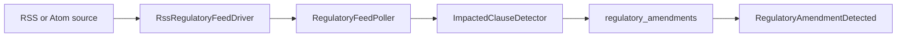

# Regulatory Feed

Regulatory feed support reads RSS 2.0 and Atom 1.0 sources, detects impacted clauses, and stores amendment records per tenant.

## Artisan command

```bash
php artisan ai-act:regulatory-poll
```

## Flow



::: callout warning "Feed hygiene"
Keep feeds allowlisted and parse XML with XXE-safe settings.
:::
